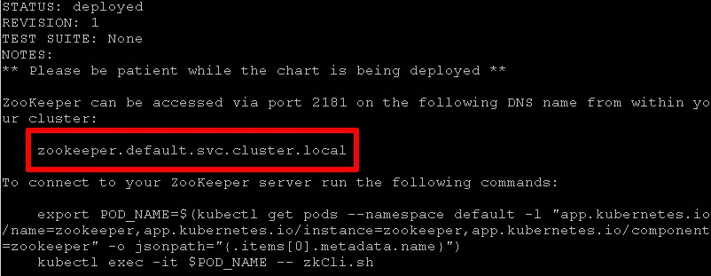
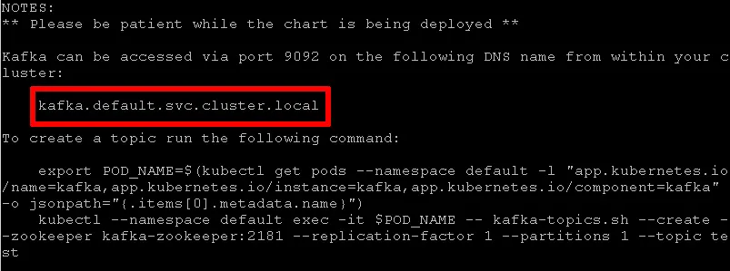
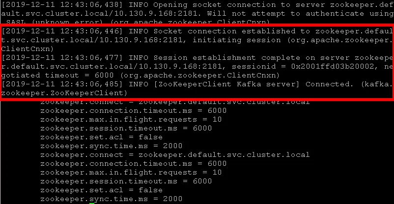

# Kafka HA Kurulumu

Link: https://docs.bitnami.com/tutorials/deploy-scalable-kafka-zookeeper-cluster-kubernetes/

Kurulum için hali hazırda var olan bitnaminin helm chartından yararlanılmıştır.

> ##### Ön Koşullar
> - Kubectl CLI var olmalı
> - Clusterınızda Helm 3.x kurulu olmalı

## Kurulum

Kurulum iki adımdan oluşmaktadır. Önce Zookeeper kurulumunu yapıp sonrasında Kafka kurulumunu yapacağız.

### 1. Zookeeper Kurulumu

```bash
# Add Bitnami chart repo
helm repo add bitnami https://charts.bitnami.com/bitnami
```

Helm repo eklendikten sonra helm fetch komutu ile chartı lokalimize indirip gerekli değişiklikleri yapabiliriz.

``` bash
cd /opt
mkdir kafka && cd kafka
helm fetch bitnami/zookeeper --untar

# fetch edildikten sonra values yaml da edit yapmak için
cd zookeeper
vi values.yaml
```

> :warning: Bu yaml içerisinde storage class ismi, prometheus kuralları persistent volume büyüklüğü, replica sayısı gibi ayarları değiştirebilirsiniz.
> - storage class: Eğer default bir storage class tanımlamanız varsa herhangi bir değişiklik yapmanıza gerek yok. Özellikle belirlemek için persistence fieldi altında yer almakta.
> - replica sayısı: Defaultta 1 olarak ayarlanmış. Arttırmak için **replicaCount** değerini değiştirmeniz yeterli
> - Volume büyüklüğü defaullta 8 GB. Değiştirmek için persistence fieldi altındaki **size** değerini değiştirmeniz yeterli. Aynı zamanda **dataLogDir** fieldi da log dosyalarının tutulacağı volume ayarları içindir.

Yukarıdaki gibi gerekli değişiklikler yapıldıktan sonra aşağıdaki komut çalıştırılır.

```bash
# Install Zookeeper
helm install zookeeper bitnami/zookeeper -f /opt/kafka/zookeeper/values.yaml
```

Yada 

```bash
# Values yaml değişiklikleri yapılmadan helm komutuyla kurma
helm install zookeeper bitnami/zookeeper \
  --set replicaCount=3 \
  --set auth.enabled=false \
  --set allowAnonymousLogin=true
```

Kurulum tamamlandıktan sonra aşağıdaki gibi bir çıktı görmeniz gerekmekte.


> :warning: Bu Zookeeper clusterı dışarıya expose edilmeyeceği için authentıcation disabled olarak verildi. Defaultta da böyle. Ancak dışarıya expose edilme durumu varsa buna göre yeniden değerlendirilmeli.

### 2. Kafka Kurulumu

Kafka kurulumu içın yine bitnami reposunu kullanacağız.

``` bash
cd /opt/kafka

helm fetch bitnami/kafka --untar

# fetch edildikten sonra values yaml da edit yapmak için
cd kafka
vi values.yaml
```

> :warning: Bu yaml içerisinde storage class ismi, prometheus kuralları persistent volume büyüklüğü, replica sayısı gibi ayarları değiştirebilirsiniz.
> - storage class: Eğer default bir storage class tanımlamanız varsa herhangi bir değişiklik yapmanıza gerek yok. Özellikle belirlemek için persistence fieldi altında yer almakta.
> - replica sayısı: Defaultta 1 olarak ayarlanmış. Arttırmak için **replicaCount** değerini değiştirmeniz yeterli
> - Volume büyüklüğü defaullta 8 GB. Değiştirmek için persistence fieldi altındaki **size** değerini değiştirmeniz yeterli. Aynı zamanda **logPersistence** fieldi da log bilgilerinin saklanması için configurasyonlar içermektedir.


> :warning: **External zookeeper kurduğumuz için zookeeper enabled false yapılmalı.**

``` yaml
## ZooKeeper chart configuration
## https://github.com/bitnami/charts/blob/master/bitnami/zookeeper/values.yaml
##
zookeeper:
## @param zookeeper.enabled Switch to enable or disable the ZooKeeper helm chart
##
enabled: true  ##-> false yapılmalı
## @param zookeeper.replicaCount Number of ZooKeeper nodes
##
replicaCount: 1
```


> :warning: Kafka configurasyonlari da yine values.yaml içerisinde değiştirilebilir.
``` yaml
 config: |-
 broker.id=-1
 listeners=PLAINTEXT://:9092
 advertised.listeners=PLAINTEXT://KAFKA_IP:9092
 num.network.threads=3
 num.io.threads=8
 socket.send.buffer.bytes=102400
 socket.receive.buffer.bytes=102400
 socket.request.max.bytes=104857600
 log.dirs=/bitnami/kafka/data
 num.partitions=1
 num.recovery.threads.per.data.dir=1
 offsets.topic.replication.factor=1
 transaction.state.log.replication.factor=1
 transaction.state.log.min.isr=1
 log.flush.interval.messages=10000
 log.flush.interval.ms=1000
 log.retention.hours=168
 log.retention.bytes=1073741824
 log.segment.bytes=1073741824
 log.retention.check.interval.ms=300000
 zookeeper.connect=ZOOKEEPER_SERVICE_NAME -> clusterda tanımlı olan zookeeper servis adı
 zookeeper.connection.timeout.ms=6000
 group.initial.rebalance.delay.ms=0
```

values.yaml dosyası kaydedildikten sonra aşağıdaki komut çalıştırılır.

``` bash
helm install kafka bitnami/kafka -f /opt/kafka/kafka/values.yaml
```

yada aşağıdaki gibi direk komut olarak ayarlar verilebilir. Tüm konfigürasyonların bu komutta geçmesi gerektiğinden hatırlanması zor ve maintenance açısından iyi değil.

``` bash
helm install kafka bitnami/kafka \
  --set zookeeper.enabled=false \
  --set replicaCount=3 \
  --set externalZookeeper.servers=ZOOKEEPER-SERVICE-NAME ##--> clusterda var olan zookeeper servis adı
```

Kurulum bittikten sonra aşağıdaki gibi bir çıktı görmeniz gerekmekte



Zookeeper ve Kafka deploymentları arasındaki bağlantının sağlanıp sağlanmadığını kontrol etmek için herhangi bir kafka podunun loglarına bakılabilir.
Aşağıdaki gibi bir çıktı görünüyorsa bağlantı sağlanmış demektir.

``` bash
kubectl logs <POD_NAME>
```



### 3. Scale Kafka

``` bash
cd /opt/kafka/kafka
vi values.yaml # değiştirilmek istenen konfigürasyonlar değiştirilir ** replica sayısı gibi**

#helm upgrade
helm upgrade kafka -f /opt/kafka/kafka/values.yaml
```

yada

``` bash
helm upgrade kafka bitnami/kafka \
  --set zookeeper.enabled=false \
  --set replicaCount=7 \
  --set externalZookeeper.servers=ZOOKEEPER-SERVICE-NAME
```

``` bash
helm upgrade zookeeper bitnami/zookeeper \
  --set replicaCount=5 \
  --set auth.enabled=false \
  --set allowAnonymousLogin=true
```
gibi komutlarla değişiklik yapılabilir. Ama yaml dosyasında yapılması daha iyi.