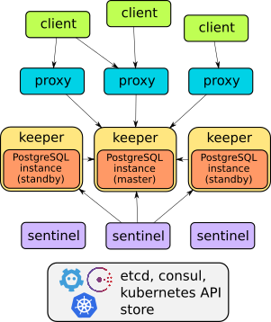

# Stolon İle Kurulum

## Stolon
Stolon bir cloud native PostgreSQL HA yöneticisidir. Kubernetes ortamı için entegre olabileceği gibi başka alt yapılar içinde uygundur(cloud IaaS, old stype infrastructures etc..) da uyumludur.

> ##### Özellikleri
> 
> - Postgresql streaming replication dan yararlanır.
> - Her türlü partitioninge karşı dayanıklıdır. Maksimum availabilityi korumak için consistencyi(tutarlılık) availabilitye tercih eder.
> - Kubernetes ile entegre olabilmekte.
> - HA data store ve lider seçimi için etcd, consule yada kubernetes API server gibi cluster storeları kullanabilir.
> - Asynchronous yada synchronous replication yapabilir.
> - Tercih ettiğiniz backup/restore toolu ile point in time recovery integration yapabilir.
> - Standby cluster
> - Otomatik servis discovery ve dinamik reconfiguration imkanı sağlar
> - pg_rewind kullanarak master ile hızlı bir şekilde instance resenkronizasyon sağlar.

### Mimari

Stolon 3 ana komponentten oluşur.

> - **keeper:** Lider sentinel tarafından hesaplanan küme görünümüne yakınsayan bir PostgreSQL örneğini yönetir.
> - **sentinel:** keeper ve proxyleri izler ve en uygun küme görünümünü hesaplar.
> - **proxy:** Clientin erişim noktasıdır. Doğru PostgreSQL birimine bağlantı yapılmasını ve eski ana ögelere yapılan bağlantıların kapatılmasını sağlar.



### Kurulum

``` bash
mkdir /opt/postgre-ha
cd /opt/postgre-ha/

git clone https://github.com/sorintlab/stolon.git

```

Repository indirildikten sonra kubernetes kurulumu için var olan örnek yamlların olduğu directorye gidilir ve gerekli değişiklikler yapılır.


``` bash
> # Postgresql Şifre Setleme

cd /stolon/examples
vi secret.yaml

# vermek istediğiniz şifrenin base64 ile hashlenmiş halini password attribunun karşısına kopyalayın

---
apiVersion: v1
kind: Secret
metadata:
    name: stolon
type: Opaque
data:
    password: cGFzc3dvcmQx --> default: password1
```


``` bash
# Keeper ayarların

vi stolon-keeper.yaml

# sadece persistent volume ayarlarını değiştirmek yeterli olacaktır.

 # Define your own volumeClaimTemplate. This example uses dynamic PV provisioning with a storage class named "standard" (so it will works by default with minikube)
 # In production you should use your own defined storage-class and configure your persistent volumes (statically or dynamically using a provisioner, see related k8s doc).
  volumeClaimTemplates:
    - metadata:
        name: data
        annotations:
          volume.alpha.kubernetes.io/storage-class: standard --> kubernetes ortamında tanımlanan storage-class name yazılmalı
      spec:
        accessModes: ["ReadWriteOnce"]
        resources:
          requests:
            storage: 512Mi --> eğer daha büyük alana ihtiyaç varsa buradan arttırılabilir.


```

```bash
# Eğer veritabanının dışarıdan erişilebilmesini istiyorsak stolon proxy servisini nodePart olarak Tanımlamak yeterli olacaktır

apiVersion: v1
kind: Service
metadata:
  name: stolon-proxy-service
spec:
  # type: NodePort --> eklenecek satır
  ports:
    - port: 5432
      targetPort: 5432
  selector:
    component: stolon-proxy
    stolon-cluster: kube-stolon --> cluster init yapılırken verilen cluster adıyla aynı olmalı


```

```bash
# stolon proxy deployment konfigürasyonu

apiVersion: apps/v1
kind: Deployment
metadata:
  name: stolon-proxy
spec:
  replicas: 2 --> replica sayısı değiştirilebilir. 
  selector:
    matchLabels:
      component: stolon-proxy
      stolon-cluster: kube-stolon --> cluster adı değiştirilmeli
```

```bash 
# stolon sentinel deployment
apiVersion: apps/v1
kind: Deployment
metadata:
  name: stolon-sentinel
spec:
  replicas: 2 --> replica sayısı değiştirilebilir.
  selector:
    matchLabels:
      component: stolon-sentinel
      stolon-cluster: kube-stolon --> cluster adı
```

> :warning: **Default olarak yaml dosyalarında stolon:master-pg10 imagesi bulunmakta. Eğer postgresql in farklı versiyonları kullanılmak istenirse docker hubdan hazır olan imageler ile değiştirilebilir yada kendi imagenizi oluşturup kullanabilirsiniz.**

``` bash
kubectl run -i -t stolonctl --image=sorintlab/stolon:master-pg10 --restart=Never --rm -- /usr/local/bin/stolonctl --cluster-name=<cluster-name> --store-backend=kubernetes --kube-resource-kind=configmap init

kubectl create -f stolon-sentinel.yaml

kubectl create -f secret.yaml

kubectl create -f stolon-keeper.yaml

kubectl create -f stolon-proxy.yaml

kubectl create -f stolon-proxy-service.yaml

```


