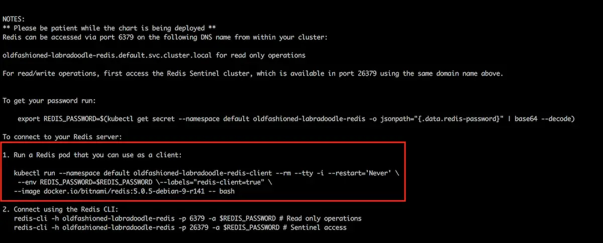
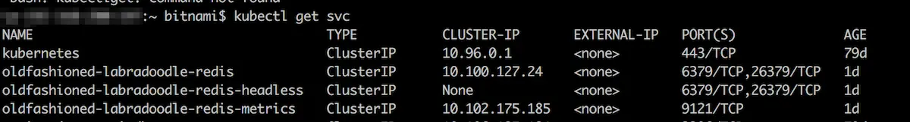
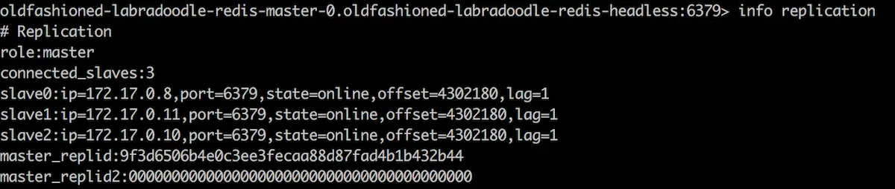
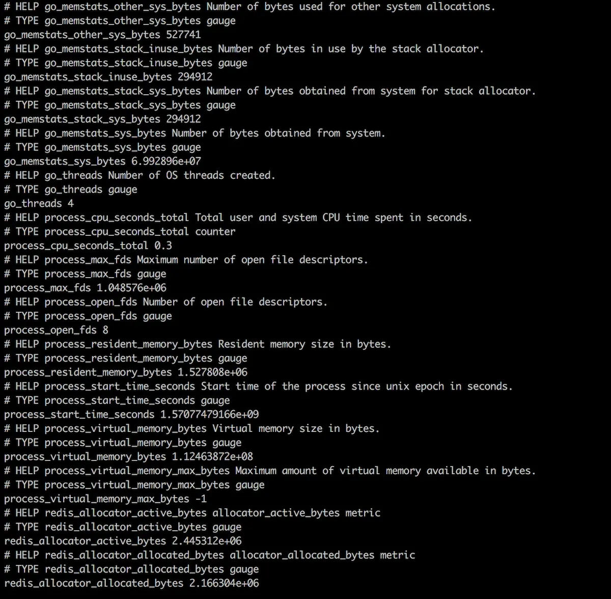

# Redis HA Kurulumu

Link: https://docs.bitnami.com/tutorials/deploy-redis-sentinel-production-cluster/

Kurulum için hali hazırda var olan bitnaminin helm chartından yararlanılmıştır.

> ##### Ön Koşullar
> - Kubectl CLI var olmalı
> - Clusterınızda Helm 3.x kurulu olmalı

## Kurulum

``` bash
# helm reposunu eklemek için
helm repo add bitnami https://charts.bitnami.com/bitnami
helm repo update

# helm chartı indirmek için bir klasör oluşturulur
cd /opt/
helm fetch bitnami/redis --untar

# Kurulumu özelleştirmek için helm template komutu ile helm chart indirilir
cd redis
vi values.yaml

# Gerekli değişiklikler yapıldıktan sonra
    # Storage-class adı --> default storage-class tanımlı ise herhangi bir işlem yapılmasına gerek yok
    # replica sayısı gibi

helm install redis-ha  --namespace <ihtar-namespace> -f values.yaml 

```

> :warning: values.yaml dosyasında asağıdaki configurasyonun olduğundan emin olunuz
``` yaml
sentinel:
  ## @param sentinel.enabled Use Redis&trade; Sentinel on Redis&trade; pods.
  ## IMPORTANT: this will disable the master and replicas services and
  ## create a single Redis&trade; service exposing both the Redis and Sentinel ports
  ##
  enabled: true
```
- Kurulum tamamlandıktan sonra terminalde master node erişimi için gerekli komut verilmektedir. Bu komut ile master node connection test yapabilirsiniz.

``` bash
kubectl run --namespace default DEPLOYMENT-NAME-redis-client --rm --tty -i --restart='Never' \
    --env REDIS_PASSWORD=$REDIS_PASSWORD \--labels="redis-client=true" \
   --image docker.io/bitnami/redis:5.0.5-debian-9-r141 -- bash
```

> :warning: DEPLOYMENT-NAME yerine kurulum yaparken verdiğiniz değeri yazmanız gerekmekte.



- Chart install edildikten sonra internal erişim için bir headles servis oluşturur. Master node erişimi için öncelikle headless servisin adını bilmek gerekmektedir. 

``` bash
kubectl get svc
```

Aşağıdaki gibi bir çıktı göremeniz gerekir.



Headless servis üzerinden erişim sağlamak için aşağıdkai komutu çalıştırabilirsiniz.

``` bash
# POD-NAME yerine erişmek istediğiniz podun adını, HEADLESS-SVC-NAME yerinde de servis adını yazmanız gerekmekte.

redis-cli -h POD-NAME.HEADLESS-SVC-NAME -a $REDIS_PASSWORD

# Ardından info komutu ile replication bilgisine erişebilirsiniz.
info replication
```



- Cluster metriclerini kontrol etmek için:

``` bash
kubectl get svc

# -metrics ile biten servis için  SVC-NAME değiştirilir
kubectl port-forward svc/SVC-NAME PORT:PORT

```

Bu komutlar sonrası port sizin local hostunuza forward edilir.

``` bash
curl 127.0.0.1:PORT/metrics
```



